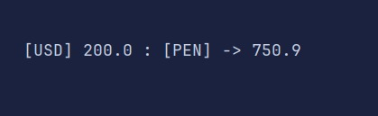

<h1>Currency Converter</h1>

<h3>Alura Challenge - Backend G6 </h3>

<h2># Descripcion Del proyecto</h2>

En este emocionante desafío de programación, a
te invitamos a construir tu propio Conversor de Monedas. 
Aprenderás a realizar solicitudes a una API de tasas de cambio,
a manipular datos JSON y, finalmente, a filtrar y mostrar las monedas
de interés. ¡Prepárate para una experiencia práctica y emocionante
en el desarrollo Java!

##  🔨 Funcionalidades del proyecto

Menu De Operaciones Posibles

Ingresando Monto

Resultado Conversion

